# Asset Manager - Modernization and Deployment to Azure Sequence Flow

This document visualizes the complete modernization and deployment journey from the legacy stack to Azure-native services.

## Overview

The modernization process transforms the Asset Manager application from:
- **From**: Java 8, Spring Boot 2.7.18, AWS S3, RabbitMQ, PostgreSQL (password-based auth)
- **To**: Java 21, Spring Boot 3.x, Azure Blob Storage, Azure Service Bus, Azure Database for PostgreSQL (managed identity)

---

## Phase 1: Assessment & Planning

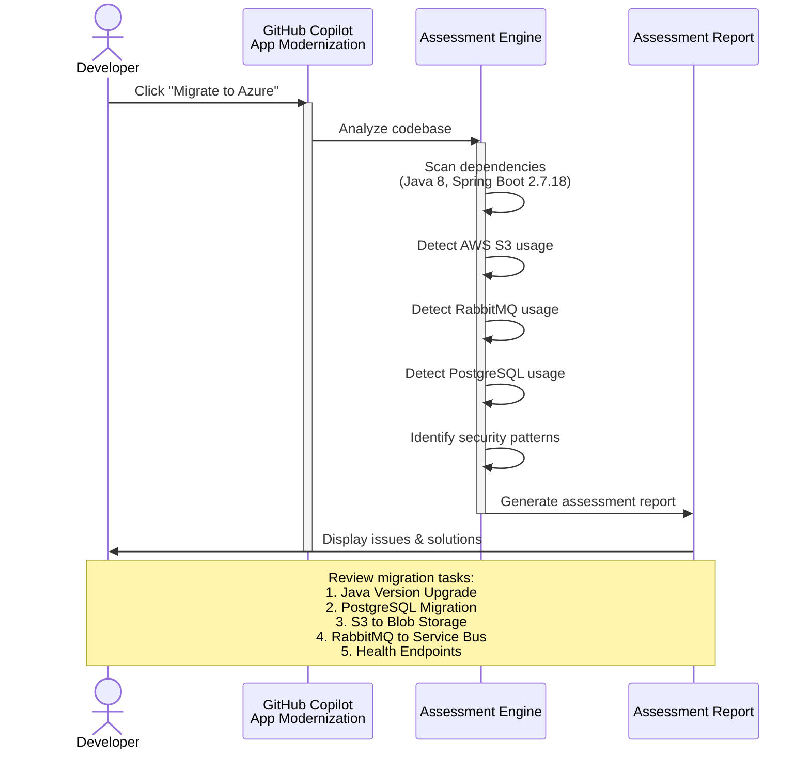

---

## Phase 2: Runtime & Framework Upgrade

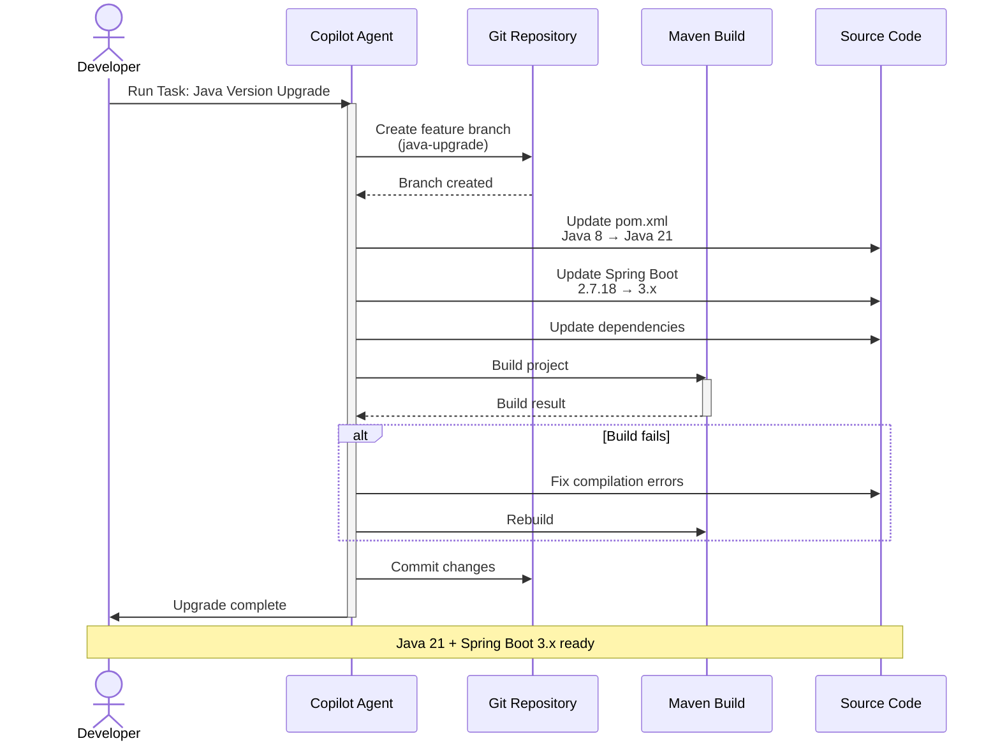

---

## Phase 3: Database Migration (PostgreSQL to Azure)

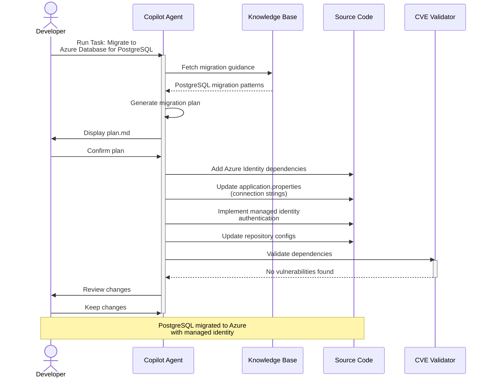

---

## Phase 4: Storage Migration (S3 to Azure Blob)

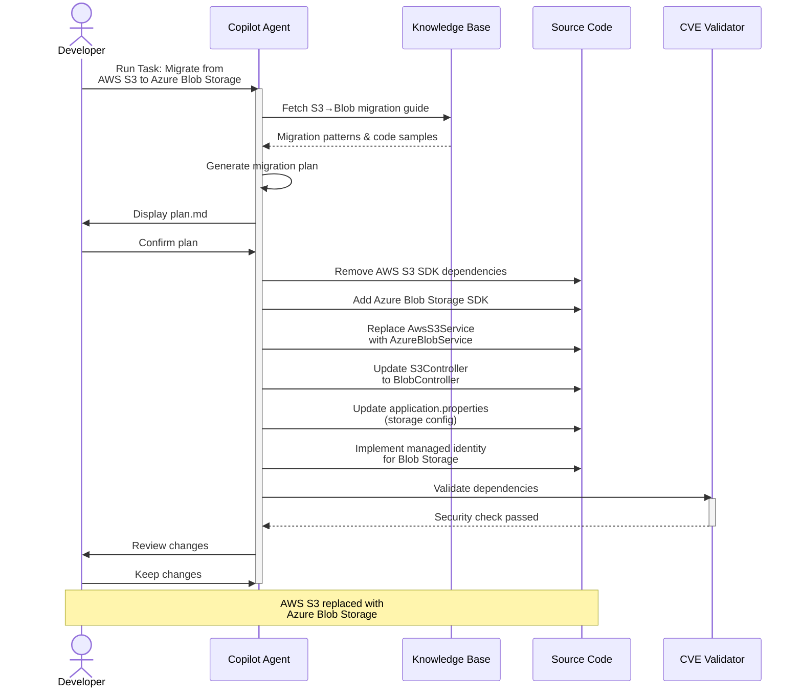

---

## Phase 5: Messaging Migration (RabbitMQ to Service Bus)

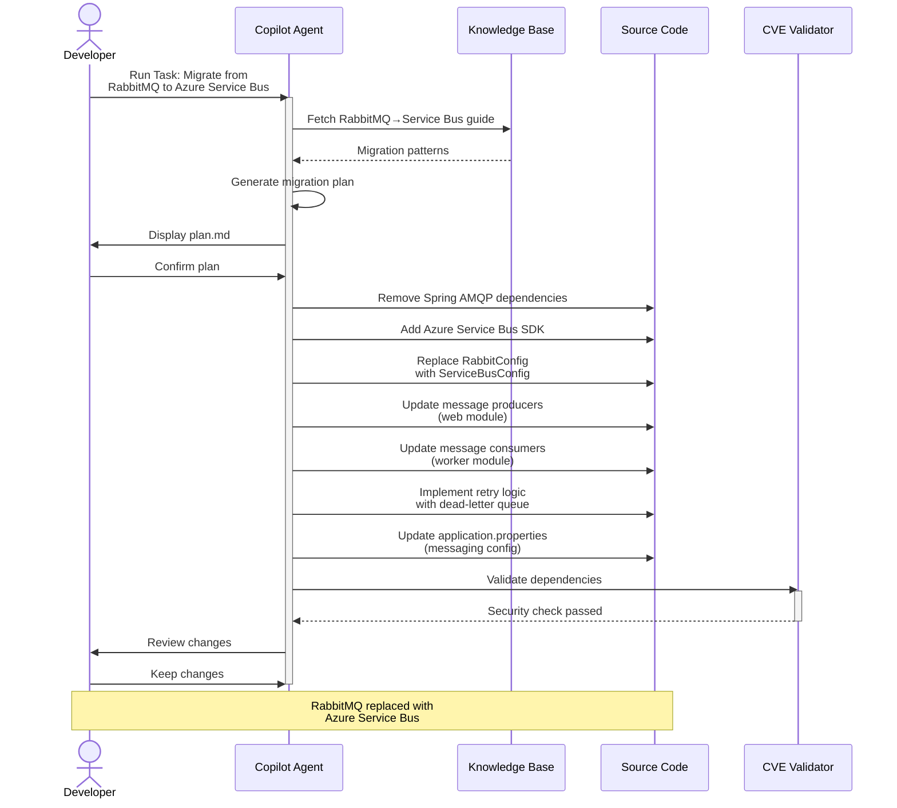

---

## Phase 6: Health Endpoints (Custom Task)

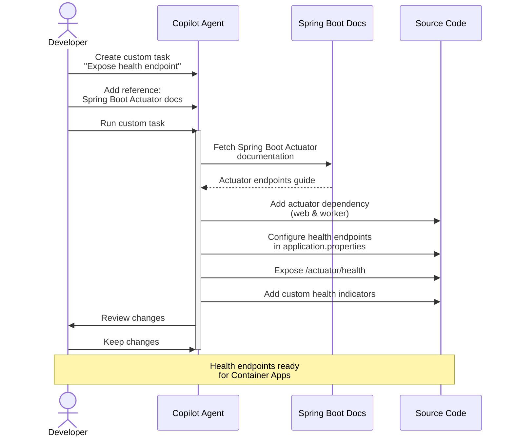

---

## Phase 7: Containerization

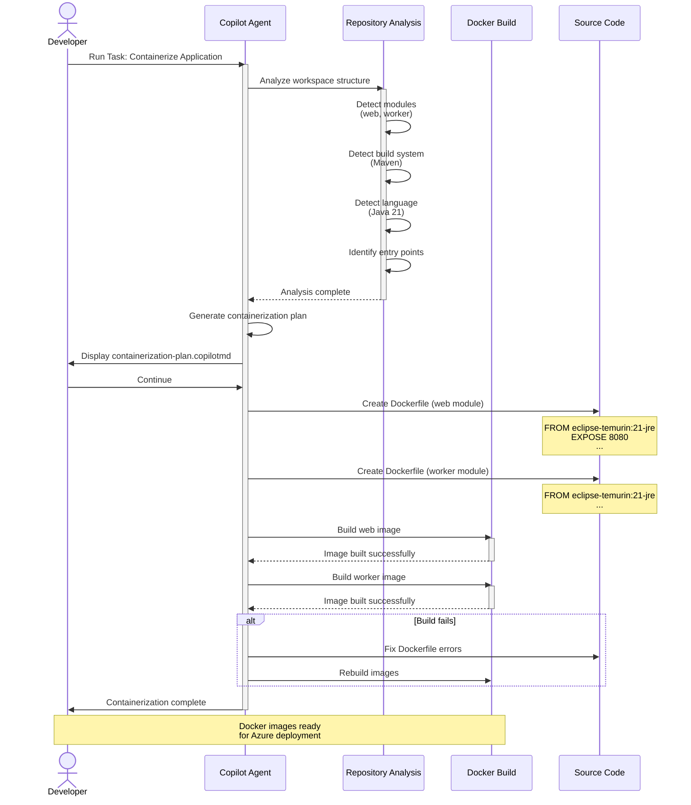

---

## Phase 8: Azure Deployment

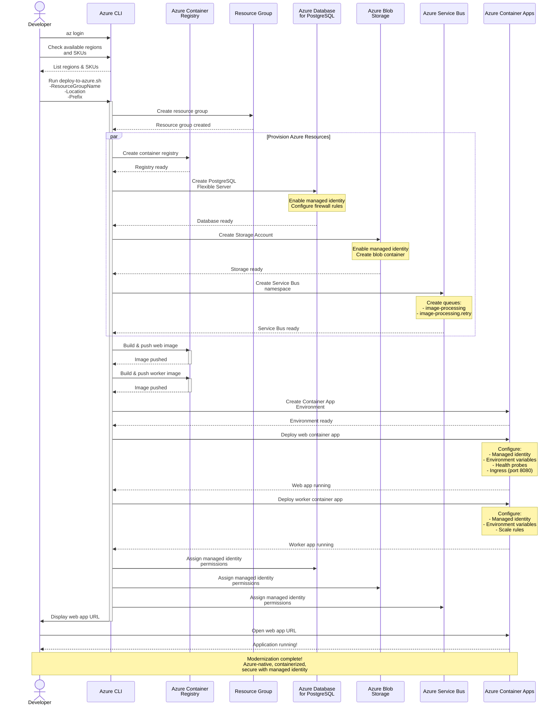

---

## Phase 9: Verification & Cleanup

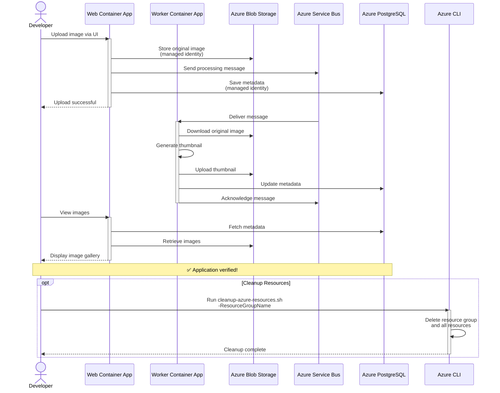

---

## Architecture Transformation Summary

### Before Modernization
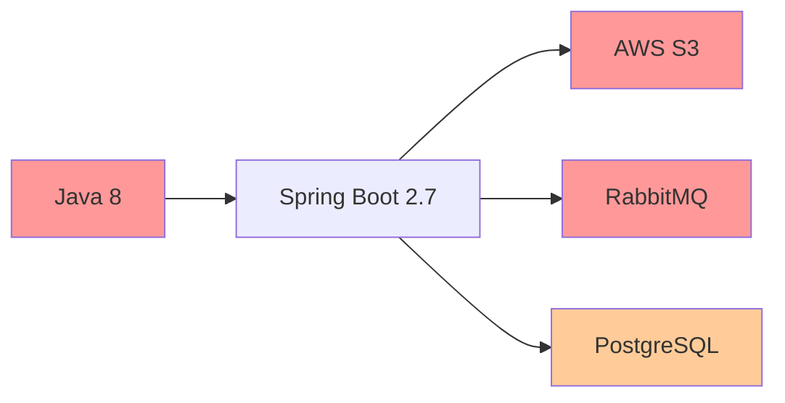

### After Modernization
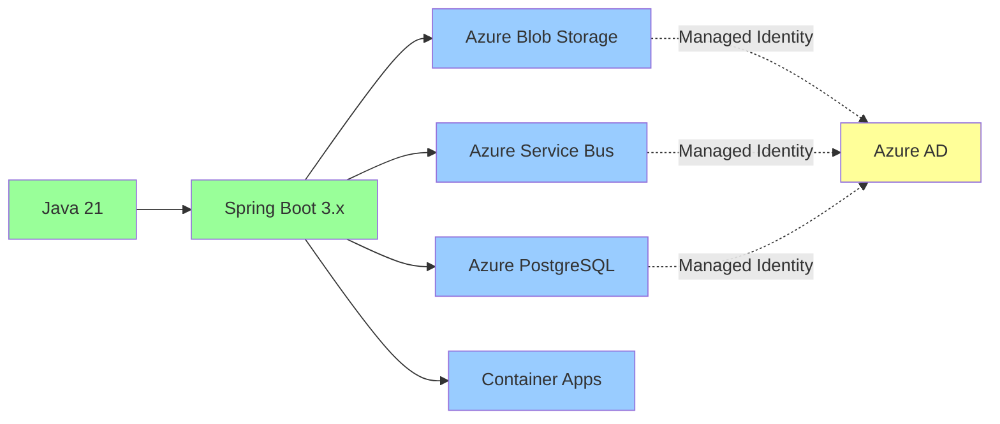

---

## Key Benefits Achieved

| Aspect | Before | After |
|--------|--------|-------|
| **Runtime** | Java 8 | Java 21 |
| **Framework** | Spring Boot 2.7.18 | Spring Boot 3.x |
| **Storage** | AWS S3 (access keys) | Azure Blob Storage (managed identity) |
| **Messaging** | RabbitMQ (password) | Azure Service Bus (managed identity) |
| **Database** | PostgreSQL (password) | Azure Database for PostgreSQL (managed identity) |
| **Deployment** | Manual/VM-based | Containerized (Azure Container Apps) |
| **Security** | Password-based auth | Managed identity + passwordless |
| **Monitoring** | None | Spring Boot Actuator health endpoints |
| **Scalability** | Limited | Auto-scaling with Container Apps |
| **Cloud-Native** | No | Yes (Azure-native services) |

---

## Migration Effort Breakdown

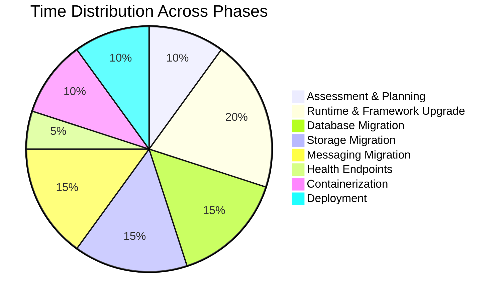

---

## Next Steps

1. **Performance Testing**: Test application under load
2. **Security Hardening**: Review and enhance security policies
3. **Monitoring Setup**: Configure Azure Monitor and Application Insights
4. **CI/CD Pipeline**: Set up automated deployment pipeline
5. **Documentation**: Update technical documentation
6. **Team Training**: Train team on new Azure services

---

*Generated for Asset Manager - Java Modernization Workshop*
