# Java Application Modernization to Azure - Executive Overview

## High-Level Modernization Journey

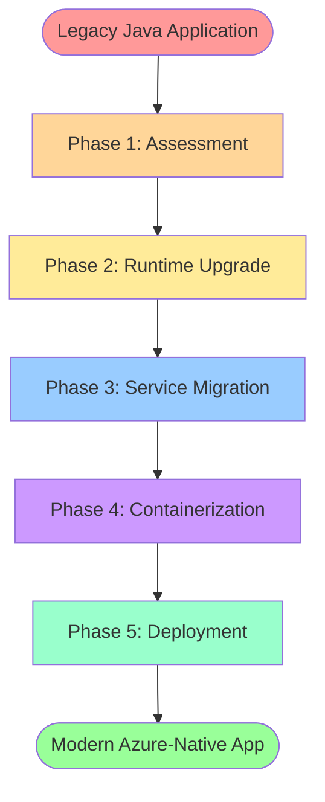

---

## Slide 1: Modernization Overview

### The Journey at a Glance

**5 Key Phases**

1. 🔍 **Assessment & Discovery**
2. ⚙️ **Runtime & Framework Upgrade**
3. ☁️ **Cloud Service Migration**
4. 📦 **Containerization**
5. 🚀 **Azure Deployment**

**Timeline**: Accelerated with GitHub Copilot (weeks vs. months)

---

## Slide 2: Phase 1 - Assessment & Discovery

### 🔍 Understanding Your Application

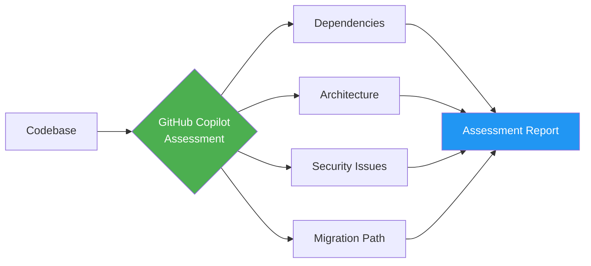

**Key Activities:**
- Automated code analysis
- Dependency scanning
- Security vulnerability detection
- Migration roadmap generation

**Deliverable:** Comprehensive Assessment Report with actionable insights

---

## Slide 3: Phase 2 - Runtime & Framework Upgrade

### ⚙️ Modernizing the Foundation

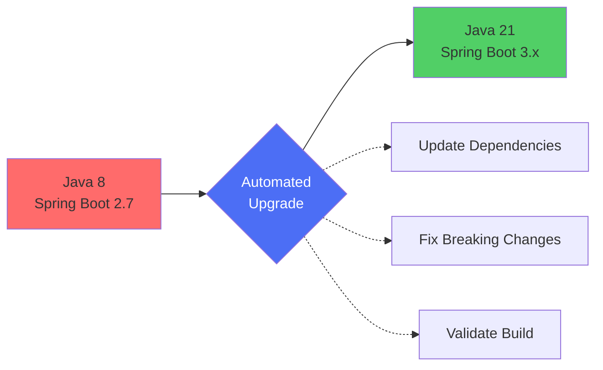

**What Gets Updated:**
- Java Runtime: 8 → 21
- Spring Boot: 2.7.x → 3.x
- All dependencies to latest secure versions
- Code patterns to modern standards

**Result:** Modern, performant, secure runtime

---

## Slide 4: Phase 3 - Cloud Service Migration

### ☁️ Embracing Azure-Native Services

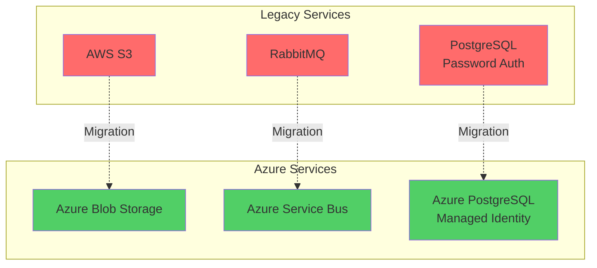

**3 Core Migrations:**

1. **Storage**: AWS S3 → Azure Blob Storage
2. **Messaging**: RabbitMQ → Azure Service Bus  
3. **Database**: PostgreSQL → Azure Database for PostgreSQL

**Security Enhancement:** Passwordless authentication with Managed Identity

---

## Slide 5: Phase 3 Details - Storage Migration

### 📁 AWS S3 → Azure Blob Storage

**Before:**
- AWS SDK for S3
- Access Key/Secret Key authentication
- S3-specific APIs

**After:**
- Azure Blob Storage SDK
- Managed Identity (passwordless)
- Azure-native APIs

**Benefits:**
- ✅ Enhanced security (no stored credentials)
- ✅ Native Azure integration
- ✅ Cost optimization
- ✅ Better performance in Azure

---

## Slide 6: Phase 3 Details - Messaging Migration

### 💬 RabbitMQ → Azure Service Bus

**Before:**
- Self-hosted RabbitMQ
- AMQP protocol
- Manual scaling
- Password-based auth

**After:**
- Fully managed Azure Service Bus
- Enterprise messaging features
- Auto-scaling
- Managed Identity authentication

**Benefits:**
- ✅ Zero infrastructure management
- ✅ Built-in reliability & HA
- ✅ Dead-letter queue support
- ✅ Enterprise-grade security

---

## Slide 7: Phase 3 Details - Database Migration

### 🗄️ PostgreSQL → Azure Database for PostgreSQL

**Before:**
- Self-managed PostgreSQL
- Password authentication
- Manual backups
- Limited monitoring

**After:**
- Azure Database for PostgreSQL Flexible Server
- Managed Identity authentication
- Automated backups
- Built-in monitoring

**Benefits:**
- ✅ Passwordless security
- ✅ Automatic updates & patches
- ✅ Point-in-time restore
- ✅ High availability built-in

---

## Slide 8: Phase 4 - Containerization

### 📦 Making Applications Cloud-Ready

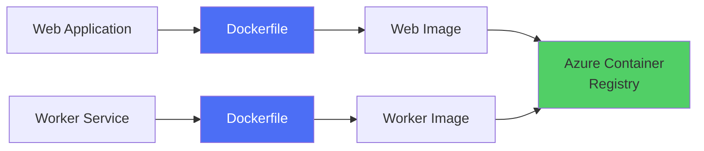

**Key Activities:**
- Generate optimized Dockerfiles
- Build container images
- Add health check endpoints
- Push to Azure Container Registry

**Result:** Portable, scalable, cloud-native containers

---

## Slide 9: Phase 5 - Azure Deployment

### 🚀 Going Live on Azure

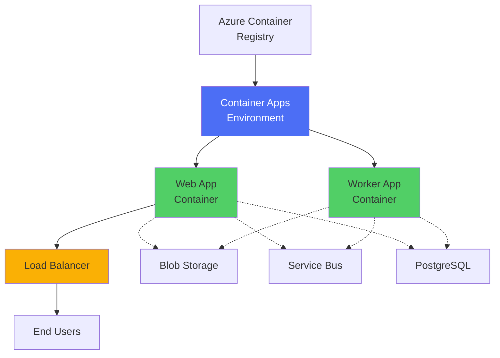

**Deployment Components:**
- Azure Container Apps (Web & Worker)
- Managed Identity configuration
- Auto-scaling rules
- Health probes
- Public ingress

**Result:** Production-ready, scalable deployment

---

## Slide 10: Before vs. After Architecture

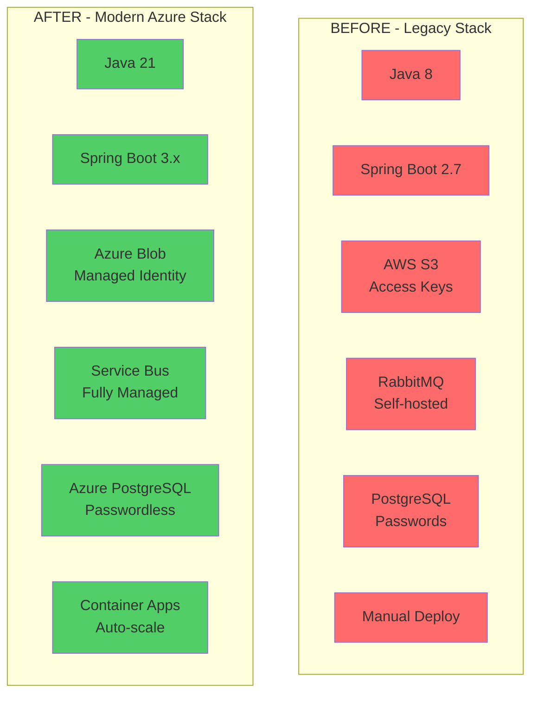

---

## Slide 11: Key Benefits Achieved

### 🎯 Business & Technical Value

| Category | Improvements |
|----------|-------------|
| **🔒 Security** | Managed Identity, passwordless auth, no credentials in code |
| **⚡ Performance** | Java 21 performance gains, optimized Azure services |
| **📈 Scalability** | Auto-scaling containers, managed services |
| **💰 Cost** | Pay-per-use, no infrastructure overhead |
| **🛡️ Reliability** | Built-in HA, automated backups, health checks |
| **⏱️ Speed** | Automated deployment, faster development cycles |
| **🔧 Maintenance** | Reduced operational burden, automated patching |

---

## Slide 12: Modernization Effort Breakdown

### ⏱️ Time Investment by Phase

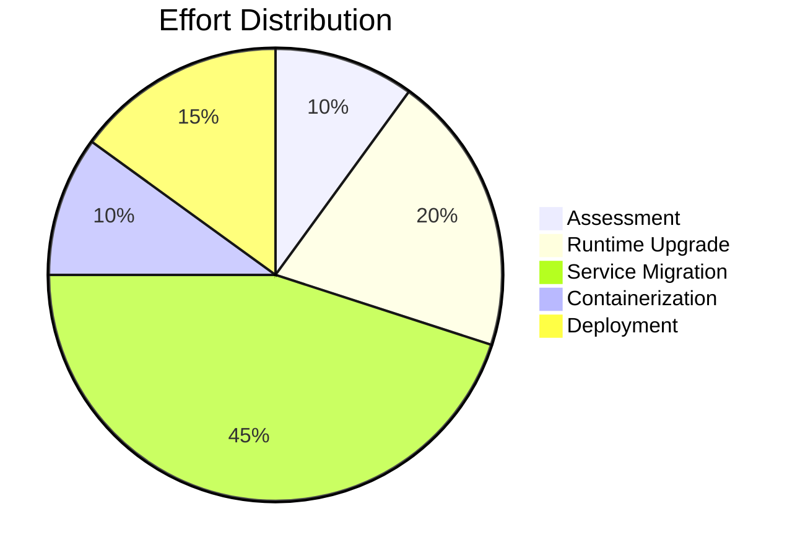

**Total Timeline with GitHub Copilot:** 2-4 weeks

**Traditional Manual Approach:** 3-6 months

**Time Saved:** 70-85% reduction

---

## Slide 13: GitHub Copilot's Role

### 🤖 AI-Powered Modernization

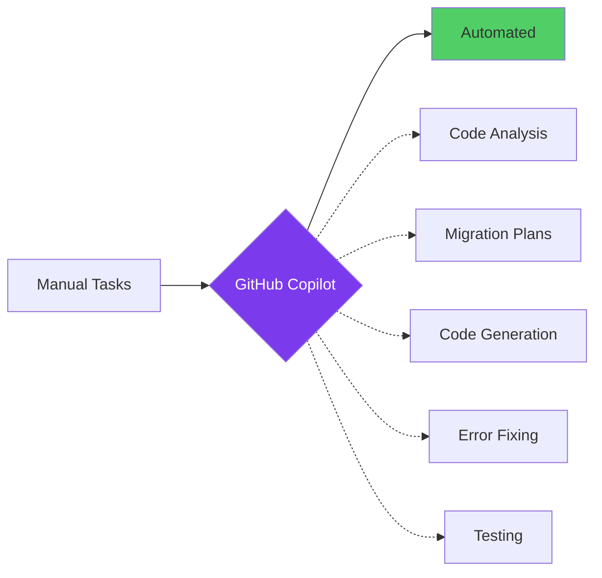

**What Copilot Automates:**
- 📊 Comprehensive code assessment
- 📝 Migration plan generation
- 🔄 Code transformation & migration
- 🐛 Build error detection & fixing
- ✅ Security validation (CVE checks)
- 📦 Dockerfile generation
- 🔍 Continuous validation

**Result:** Accelerated, accurate, guided modernization

---

## Slide 14: Security Transformation

### 🔐 From Passwords to Passwordless

**Before:**

```
❌ Access keys in config files
❌ Passwords in environment variables
❌ Credential rotation overhead
❌ Security risk exposure
```

**After:**

```
✅ Managed Identity for all Azure services
✅ Zero credentials in code
✅ Automatic credential rotation
✅ Azure AD integration
✅ Role-based access control (RBAC)
```

**Security Posture:** Enterprise-grade, Zero Trust architecture

---

## Slide 15: Scalability & Resilience

### 📊 Built for Growth

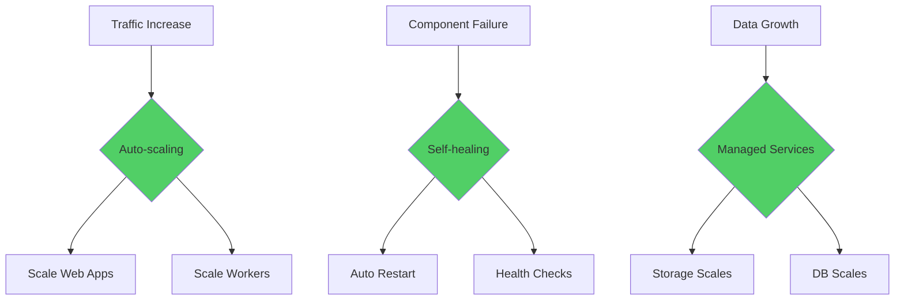

**Key Features:**
- Horizontal auto-scaling
- Self-healing containers
- Load balancing
- Automated failover
- Geographic distribution ready

---

## Slide 16: Cost Optimization

### 💰 Efficient Cloud Economics

**Cost Savings:**

| Area | Savings |
|------|---------|
| Infrastructure Management | 60-70% |
| Operational Overhead | 50-60% |
| Development Time | 70-85% |
| Security & Compliance | 40-50% |

**Azure Pricing Model:**
- Pay only for what you use
- No idle infrastructure costs
- Consumption-based pricing
- Reserved instance options

**ROI Timeline:** 6-12 months

---

## Slide 17: Deployment Architecture

### 🏗️ Production-Ready Infrastructure

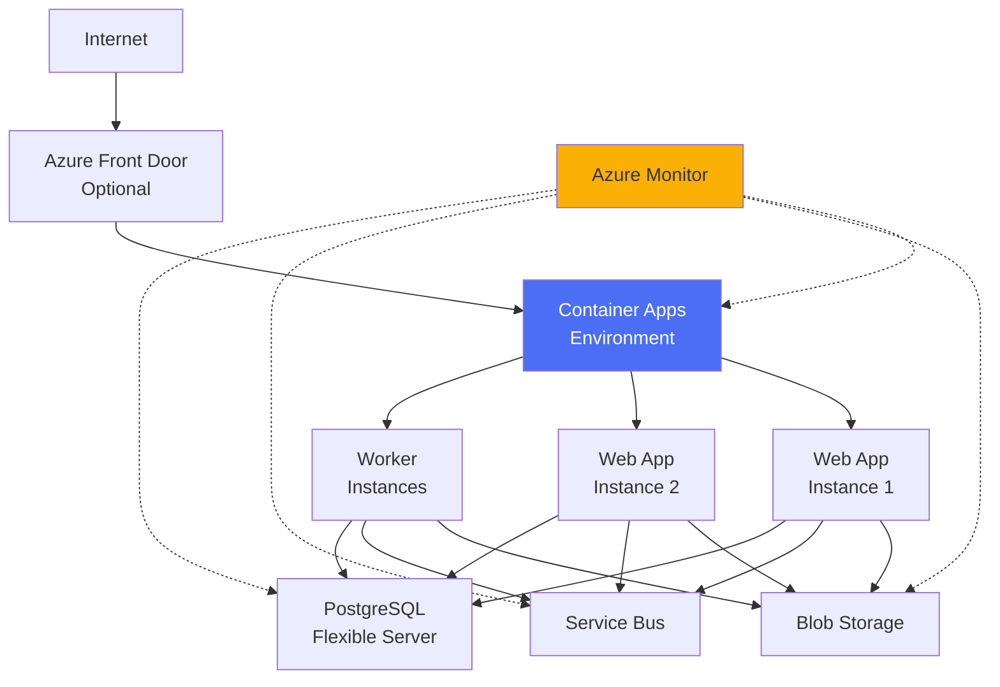

---

## Slide 18: Monitoring & Observability

### 📊 Full Visibility

**Built-in Capabilities:**

- 🏥 **Health Endpoints**: `/actuator/health` for readiness/liveness
- 📈 **Metrics**: CPU, memory, request counts, latency
- 📝 **Logs**: Centralized logging with Azure Monitor
- 🚨 **Alerts**: Automated incident detection
- 📊 **Dashboards**: Real-time application insights
- 🔍 **Distributed Tracing**: Request flow analysis

**Integration:**
- Azure Monitor
- Application Insights
- Log Analytics
- Azure Dashboards

---

## Slide 19: Migration Risk Mitigation

### 🛡️ Safe & Controlled Migration

**Risk Management Strategy:**

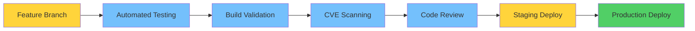

**Safety Measures:**
- Automated testing at each phase
- CVE vulnerability scanning
- Build validation before merge
- Staging environment testing
- Rollback capabilities
- Blue-green deployment ready

---

## Slide 20: Success Metrics

### 📈 Measuring Modernization Success

**Technical KPIs:**
- ✅ Zero security vulnerabilities (CVE-free)
- ✅ 99.9% uptime SLA
- ✅ 40% performance improvement (Java 21)
- ✅ Auto-scaling from 1-10 instances
- ✅ <2 sec response times

**Business KPIs:**
- ✅ 70-85% time to market reduction
- ✅ 60% infrastructure cost savings
- ✅ 50% operational overhead reduction
- ✅ Enhanced security posture
- ✅ Developer productivity increase

---

## Slide 21: Next Steps & Roadmap

### 🚀 Post-Modernization Actions

**Immediate (Week 1-2):**
1. Performance testing & optimization
2. Security audit & hardening
3. Monitoring dashboard setup
4. Documentation updates

**Short-term (Month 1-2):**
1. CI/CD pipeline implementation
2. Advanced monitoring & alerting
3. Team training on Azure services
4. Disaster recovery testing

**Long-term (Quarter 1-2):**
1. Multi-region deployment
2. Advanced Azure features adoption
3. Cost optimization review
4. Continuous improvement cycle

---

## Slide 22: Lessons Learned

### 💡 Key Takeaways

**What Worked Well:**
- ✅ GitHub Copilot dramatically accelerated migration
- ✅ Automated assessment provided clear roadmap
- ✅ Incremental migration reduced risk
- ✅ Managed Identity improved security
- ✅ Containerization simplified deployment

**Best Practices:**
- 📋 Always start with comprehensive assessment
- 🔄 Migrate in phases, not all at once
- ✅ Validate after each phase
- 🔒 Security first approach
- 📊 Monitor continuously

---

## Slide 23: Call to Action

### 🎯 Start Your Modernization Journey

**Ready to Modernize?**

**Step 1:** Install GitHub Copilot app modernization
**Step 2:** Run assessment on your application  
**Step 3:** Review migration roadmap
**Step 4:** Execute phase-by-phase migration
**Step 5:** Deploy to Azure with confidence

**Tools You Need:**
- GitHub Copilot subscription
- Visual Studio Code / IntelliJ IDEA
- Azure subscription
- Git repository

**Resources:**
- [GitHub Copilot app modernization](https://marketplace.visualstudio.com/items?itemName=vscjava.migrate-java-to-azure)
- [Azure Migration Center](https://azure.microsoft.com/migration/)
- Sample projects & documentation

---

## Quick Reference: Phase Summary

| Phase | Duration | Key Activities | Outcome |
|-------|----------|----------------|---------|
| **1. Assessment** | 1-2 days | Code analysis, report generation | Migration roadmap |
| **2. Runtime Upgrade** | 3-5 days | Java & Spring Boot upgrade | Modern runtime |
| **3. Service Migration** | 1-2 weeks | Azure service integration | Cloud-native services |
| **4. Containerization** | 2-3 days | Docker image creation | Container-ready apps |
| **5. Deployment** | 1-2 days | Azure deployment & testing | Production-ready |

**Total Timeline:** 2-4 weeks (vs. 3-6 months manual)

---

## Contact & Resources

### 📚 Additional Information

**Documentation:**
- GitHub Copilot app modernization guide
- Azure migration documentation
- Sample applications & workshops

**Support:**
- GitHub Copilot support
- Azure migration support
- Community forums

**Demo:** Asset Manager Application
- Before: Java 8, AWS, RabbitMQ
- After: Java 21, Azure-native, containerized

---

*Modernize with Confidence using GitHub Copilot & Azure*
